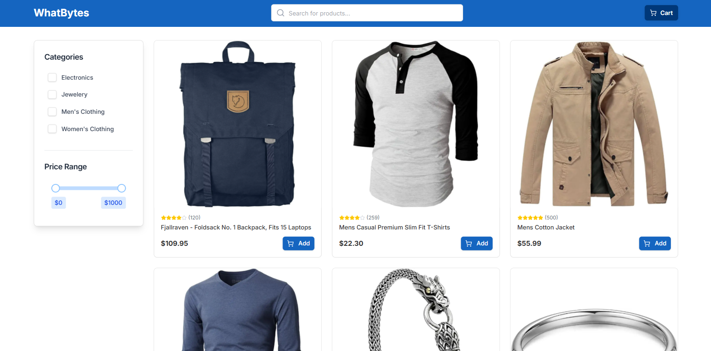
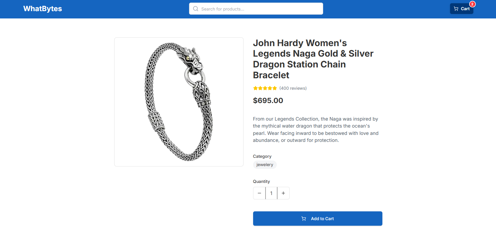
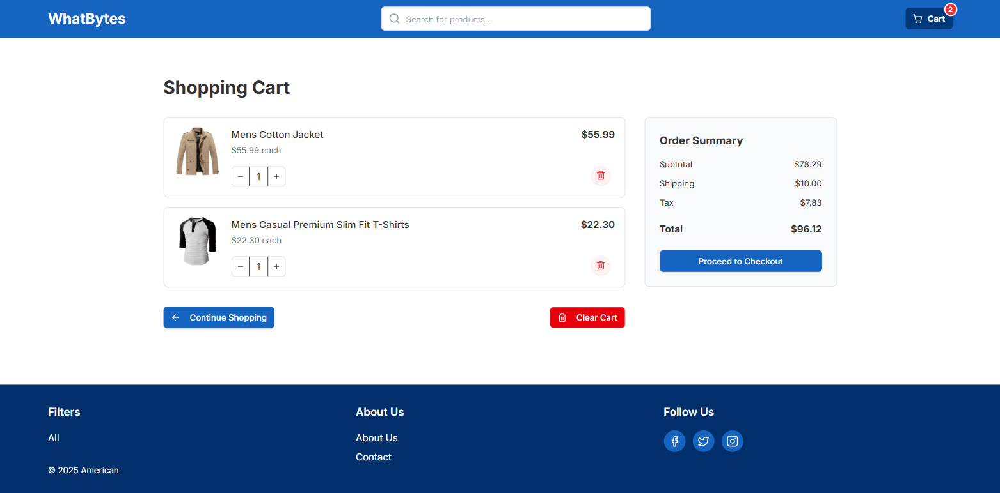

# WhatBytes - Modern E-commerce Platform

A modern, responsive e-commerce web application built with Next.js 14, featuring a clean UI, shopping cart functionality, and seamless user experience.

## 📸 Screenshots

### Home Page


### Product Details


### Shopping Cart


## 🚀 Features

- **Modern UI/UX**: Clean, professional design with responsive layout
- **Product Catalog**: Browse products with category filtering and search
- **Shopping Cart**: Add, remove, and manage items with real-time updates
- **Infinite Scroll**: Smooth product loading with automatic pagination
- **Search & Filters**: Advanced filtering by category, price, and search queries
- **Responsive Design**: Optimized for desktop, tablet, and mobile devices
- **SEO Optimized**: Server-side rendering with proper meta tags
- **Fast Performance**: Built with Next.js 14 and optimized for speed

## 🛠️ Tech Stack

- **Framework**: [Next.js 14](https://nextjs.org/) (App Router)
- **Language**: [TypeScript](https://www.typescriptlang.org/)
- **Styling**: [Tailwind CSS](https://tailwindcss.com/)
- **UI Components**: Custom components with [Radix UI](https://www.radix-ui.com/)
- **State Management**: [Zustand](https://zustand-demo.pmnd.rs/)
- **Icons**: [Lucide React](https://lucide.dev/)
- **Data Fetching**: [Fake Store API](https://fakestoreapi.com/)

## 📦 Installation

1. **Clone the repository**
   ```bash
   git clone https://github.com/yourusername/whatbytes.git
   cd whatbytes
   ```

2. **Install dependencies**
   ```bash
   npm install
   # or
   yarn install
   # or
   pnpm install
   ```

3. **Run the development server**
   ```bash
   npm run dev
   # or
   yarn dev
   # or
   pnpm dev
   ```

4. **Open your browser**
   Navigate to [http://localhost:3000](http://localhost:3000)

## 🎯 Project Structure

```
whatbytes/
├── app/                    # Next.js App Router
│   ├── cart/              # Shopping cart page
│   ├── product/[id]/      # Dynamic product pages
│   ├── about/             # About page
│   ├── contact/           # Contact page
│   ├── layout.tsx         # Root layout
│   ├── page.tsx           # Home page
│   └── globals.css        # Global styles
├── components/            # Reusable components
│   ├── ui/               # UI components
│   ├── Header.tsx        # Navigation header
│   ├── Footer.tsx        # Site footer
│   ├── ProductCard.tsx   # Product display card
│   ├── ProductGrid.tsx   # Product listing grid
│   ├── SearchInput.tsx   # Search functionality
│   └── Sidebar.tsx       # Filters sidebar
├── lib/                  # Utility functions
│   ├── store.ts         # Zustand store
│   ├── types.ts         # TypeScript types
│   ├── data.ts          # Data fetching functions
│   └── utils.ts         # Helper utilities
└── public/              # Static assets
```

## 🌟 Key Features Breakdown

### 🛒 Shopping Cart
- Add/remove products with quantity management
- Real-time price calculations
- Persistent cart state across sessions
- Modern cart UI with smooth animations

### 🔍 Search & Filtering
- Real-time product search
- Category-based filtering
- Price range filtering
- URL-based filter persistence

### 📱 Responsive Design
- Mobile-first approach
- Adaptive layouts for all screen sizes
- Touch-friendly interactions
- Optimized for performance

### ⚡ Performance Optimizations
- Server-side rendering (SSR)
- Image optimization with Next.js Image component
- Lazy loading and code splitting

## 🎨 Design System

- **Typography**: Inter font family
- **Components**: Custom-built with consistent styling
- **Responsive Breakpoints**: Mobile, Tablet, Desktop
- **Accessibility**: WCAG compliant with proper ARIA labels

## 👨‍💻 Developer

**Shailesh**
- GitHub: [@shaileshkandari](https://github.com/ShaileshIshere)
- LinkedIn: [shailesh kandari](https://www.linkedin.com/in/shailesh-kandari-a33112299/)

## 🙏 Acknowledgments

- [Next.js](https://nextjs.org/) for the amazing framework
- [Tailwind CSS](https://tailwindcss.com/) for the utility-first CSS
- [Fake Store API](https://fakestoreapi.com/) for the demo data
- [Vercel](https://vercel.com/) for hosting and deployment

---

**Built with ❤️ using Next.js and TypeScript**